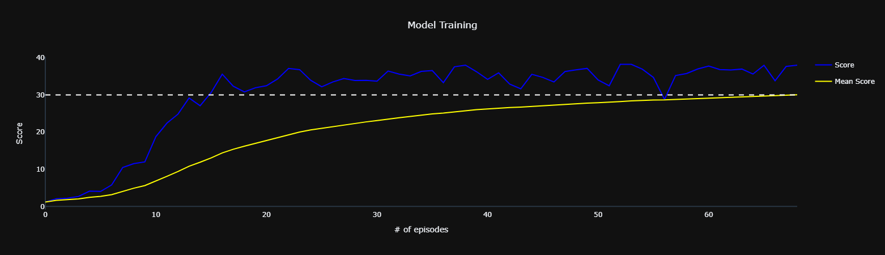

# Project 2: Continuous Control

## Description of the implementation

### Algorithm

In order to solve this challenge, I have explored and implemented the Deep Deterministic Policy Gradient algorithm (DDPG).

### Development

For this project I began by revisiting the DDQN and Dueling-DQN implementations from my previous project. I realized that DDPG is quite similar to DQN so I just had to make a few changes to the code to make it work. The main difference is that DDPG uses two networks for each agent: one for the actor and another for the critic. The actor network is used to estimate the best action to take in a given state, while the critic network is used to estimate the value of that action. The critic network is updated using the Bellman equation, while the actor network is updated using the gradient of the critic network.

I also explored a variety of network architectures and hyperparameters. I started with the same architecture I used for the DQN implementation, but I realized that it was not working well for this problem. I then tried a few other architectures, eventually settling on the following architecture and hyperparameters:

```
================================================================================
Actor Architecture:
Network(
  (network): Sequential(
    (fc1): Linear(in_features=33, out_features=128, bias=True)
    (relu1): ReLU()
    (fc2): Linear(in_features=128, out_features=128, bias=True)
    (relu2): ReLU()
    (fc3): Linear(in_features=128, out_features=4, bias=True)
    (out_activation): Tanh()
  )
)
================================================================================
Critic Architecture:
Network(
  (network): Sequential(
    (fc1): Linear(in_features=37, out_features=128, bias=True)
    (relu1): ReLU()
    (fc2): Linear(in_features=128, out_features=128, bias=True)
    (relu2): ReLU()
    (fc3): Linear(in_features=128, out_features=1, bias=True)
    (out_activation): Sigmoid()
  )
)
================================================================================
Hyperparameters:
buffer_size:     100000
batch_size:         128
gamma:           0.9900
tau:             0.1000
actor_lr:        0.0010
actor_lr_decay:  0.9990
critic_lr:       0.0010
critic_lr_decay: 0.9990
update_every:         2
================================================================================
```

This model was able to solve the environment in 324 episodes, as you can see in the training progress chart below:



> The dashed line represents the target score of 30.0

### Future Work

I would like to explore the following ideas in the future:
1. Although I have spent a great deal of time tailoring the hyperparameters, there may be other sets of values that conduce the Agent to solve the environment even faster. Thus, more tests might be performed to verify that.
2. Including Ornstein-Uhlenbeck noise in the action selection process.
3. Implementing the Prioritized Experience Replay.
4. Trying some of the other Actor-Critic algorithms, such as A3C, A2C, and PPO.
